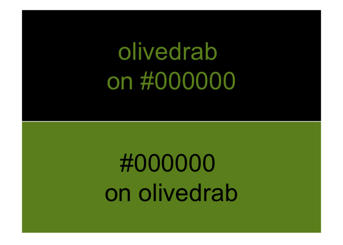
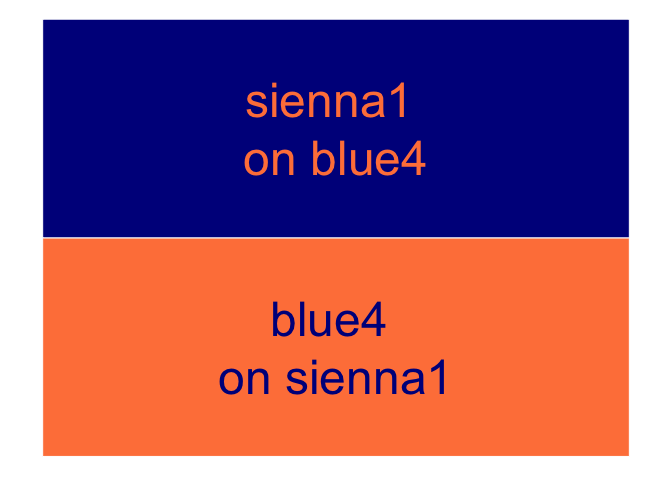

<!-- README.md is generated from README.Rmd. Please edit that file -->

# {coloratio}

<!-- badges: start -->

[](https://www.repostatus.org/#concept)
[](https://github.com/matt-dray/coloratio/actions)
<!-- badges: end -->

This work-in-progress R package helps calculate color-contrast values so
you can make decisions to improve the visual accessibility of your R
outputs.

It was originally developed with the need for selecting high-contrast
text colors for use on block-colored backgrounds. The ultimate aim is to
create a tool for compliance with [WCAG
3.0](https://w3c.github.io/silver/guidelines/).

Feel free to add an issue or a make a pull request. Please follow [the
code of
conduct](https://www.contributor-covenant.org/version/2/0/code_of_conduct/).

*Update (2020-12-25): I discovered that [the {savonliquide}
package](https://github.com/feddelegrand7/savonliquide) by [Ihaddaden M.
El Fodil](https://twitter.com/moh_fodil) achieves the main aim of this
package using [the WebAIM contrast checker
API](https://webaim.org/resources/contrastchecker/).*

## Installation

You can install the development version of {coloratio} from GitHub with:

``` r
remotes::install_github("matt-dray/coloratio")
```

## Examples

### Get contrast ratio

The `cr_get_ratio()` function returns the color-contrast ratio of two
user-provided colors. You can provide hex values, named colors, or both.

``` r
library(coloratio)
cr_get_ratio("#000000", "white")
# [1] 21
```

You should aim for a value of 4.5 or greater. You’ll get a warning if
the contrast between the colors is insufficient.

``` r
cr_get_ratio("black", "grey10")
# Warning in cr_get_ratio("black", "grey10"): Aim for a value of 4.5 or higher.
# [1] 1.206596
```

[Read more about the
calculation](https://www.w3.org/TR/WCAG/#dfn-relative-luminance) in the
WCAG 2.1 guidance.

### Colour contrast demo

`cr_get_ratio()` also lets you view a plot of text on a block background
using the supplied colors by setting `view = TRUE`.

``` r
cr_get_ratio("#000000", "olivedrab", view = TRUE)
```



    # [1] 5.51863

You can access this visual functionality in isolation with
`cr_view_contrast()`.

``` r
cr_view_contrast("blue4", "sienna1")
```



### Choose black or white

You may want to alter programmatically the color of overlaying elements
when the underlying color varies. For example, when putting text over
the bars of a grouped bar chart.

The function `cr_choose_bw()` returns `"white"` or `"black"` depending
on which has the better contrast ratio with the user-supplied color.

``` r
cr_choose_bw("gray10")
# [1] "white"
cr_choose_bw("gray90")
# [1] "black"
```

Black is chosen in the event of a tie and a warning is given.

### Choose a high-contrast color

You can use `cr_choose_color()` to check a user-supplied color against
all named R colors and return those with greatest contrast.

``` r
cr_choose_color("midnightblue")
# [1] "white"

cr_choose_color(
  col = "olivedrab",  # user-supplied color
  n = 3,              # number of colors to return
  ex_bw = TRUE        # exclude black, whites, grays?
)
# [1] "navy"     "navyblue" "blue4"
```

You have the option to exclude black, whites and grays from being
returned because they’re boring.

## Code of Conduct

Please note that the {coloratio} project is released with a [Contributor
Code of
Conduct](https://contributor-covenant.org/version/2/0/CODE_OF_CONDUCT.html).
By contributing to this project, you agree to abide by its terms.
